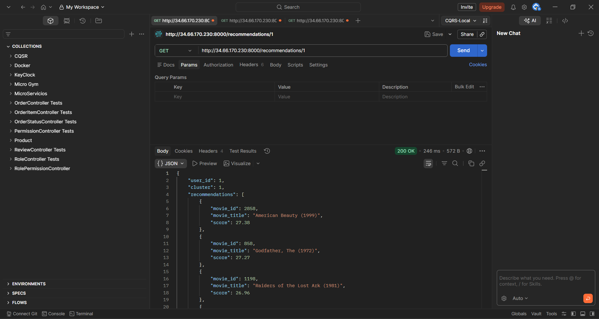
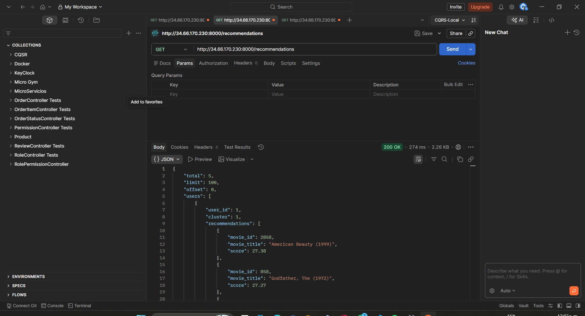
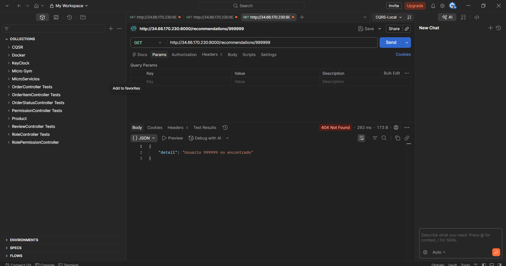
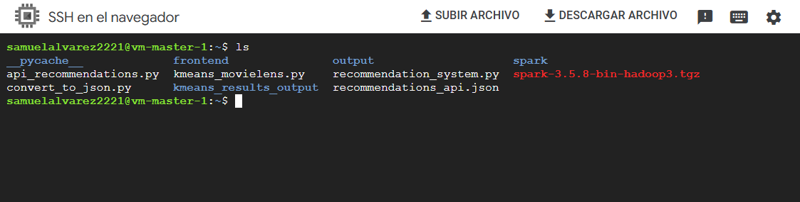
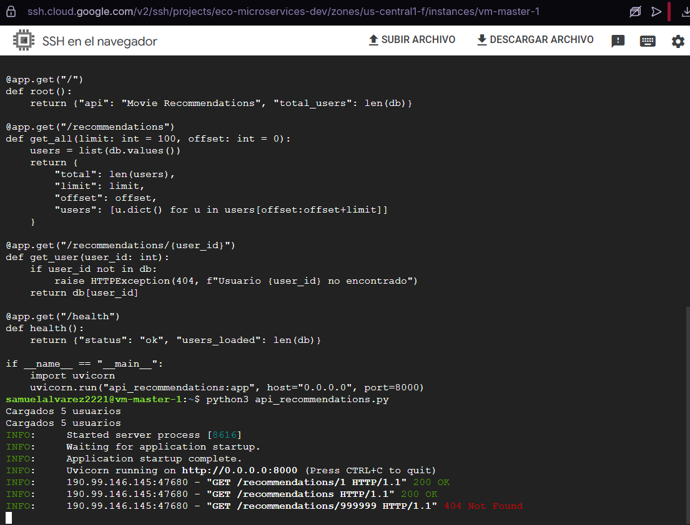
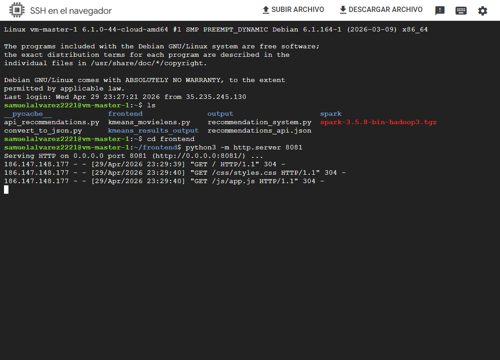
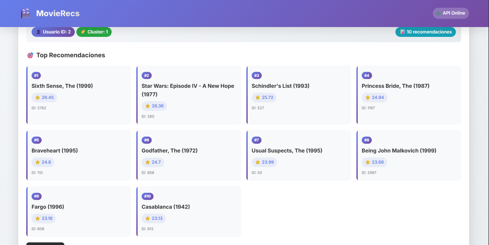
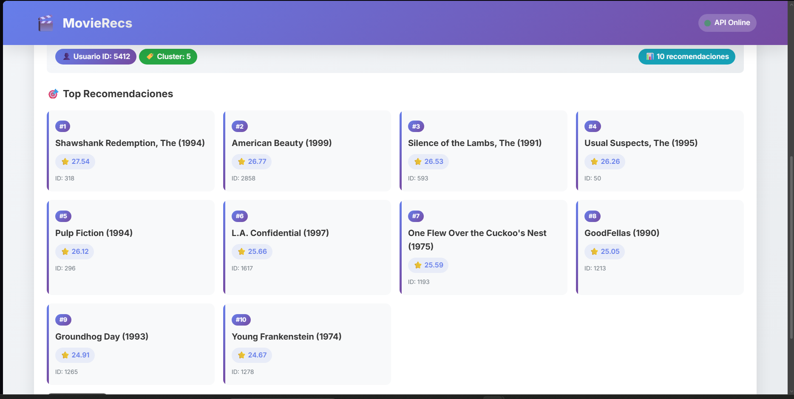
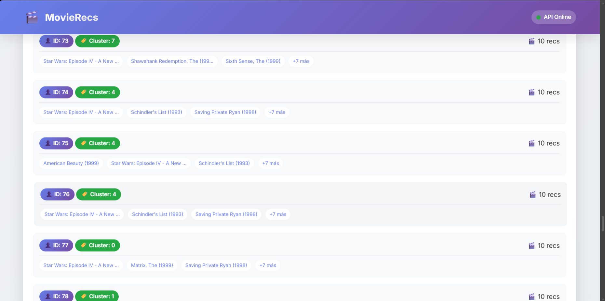
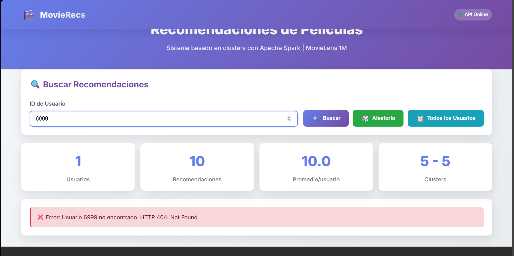

# Estudiantes: Samuel Alvarez, Alejandro Muñoz
# Sistema de recomendación (MovieLens 1M)

Este trabajo se implementó en dos partes que se conectan entre sí:

1) **Proceso batch en Spark**: segmenta usuarios con **K-Means** usando features simples (actividad y promedio de rating) y genera **recomendaciones por usuario** basadas en su cluster.
2) **API en FastAPI**: consume un **JSON** generado a partir de la salida del proceso de Spark y expone endpoints para consultar recomendaciones por usuario o para todos los usuarios.

La idea es separar el cómputo pesado (clustering + recomendaciones) del consumo en tiempo real (consultas vía API).

---

## Implementación 1: Clustering y recomendaciones con Spark (K-Means)

Archivo: `spark-kmeans.py`

### Objetivo

- **Clustering**: agrupar usuarios de MovieLens 1M en $K$ segmentos usando K-Means.
- **Recomendación por cluster**: recomendar películas a cada usuario según las películas mejor valoradas/populares en su cluster, **excluyendo** las ya vistas por el usuario.
- **Evaluación**: medir calidad con **Precision@K** y **Recall@K** con un split train/test.

### Entradas

- `ratings.dat` con formato `UserID::MovieID::Rating::Timestamp`
- `movies.dat` con formato `MovieID::Title::Genres`

El script soporta dataset local (carpeta `ml-1m`) o ruta `gs://`.

### Carga de datos (local y GCS con fallback)

- `load_ratings()` y `load_movies()` leen localmente con `spark.read.text(...)` y luego separan por `::`.
- Si el path comienza con `gs://`, intenta leer directo desde Spark.
- Si no es posible (conector/permiso), hace **fallback**:
	- el driver descarga `ratings.dat` / `movies.dat` con `gcloud storage cp`
	- se leen con Pandas y luego se crea el DataFrame en Spark (`spark.createDataFrame(...)`).

### Features usadas para el clustering

Se construyen features por usuario con `build_user_features()`:

- `movies_rated`: cantidad de películas calificadas (actividad)
- `avg_rating`: promedio del rating que el usuario suele dar (tendencia/sesgo)

Luego `scale_features()` arma el vector y estandariza:

- `VectorAssembler` → `features_raw`
- `StandardScaler(withMean=True, withStd=True)` → `features`

Esto es importante porque K-Means es sensible a escala.

### Entrenamiento K-Means y asignación de clusters

Para cada valor de K (configurable por `--k-values`), `generate_recommendations_for_k()`:

1) Entrena `KMeans(featuresCol="features", k=K)`
2) Asigna cluster a cada usuario (`prediction` → `cluster`)
3) Calcula estadísticas por cluster (`cluster_stats`):
	 - `avg_movies_rated`
	 - `avg_user_rating`
	 - `num_users`
4) Agrega una interpretación simple del cluster con `describe_cluster()`.

### Construcción de recomendaciones por usuario

La recomendación se construye en dos niveles:

1) **Score por película dentro del cluster** (`cluster_movie_scores`)
	 - Se une `train_ratings` con el cluster del usuario.
	 - Se agrupa por `(cluster, movieId)`.
	 - Se calcula:
		 - `cluster_avg_movie_rating` = promedio de ratings en ese cluster
		 - `cluster_rating_count` = cantidad de ratings en ese cluster
	 - Se define un score final:

$$
score = cluster\_avg\_movie\_rating \times \log(1 + cluster\_rating\_count)
$$

La parte `log(1 + count)` evita que una película con muchísimos votos “domine” de forma excesiva, pero igual premia el soporte.

2) **Recomendación final por usuario**
	 - Para cada usuario se toman las películas candidatas del cluster.
	 - Se eliminan las ya vistas/calificadas en train con un `left_anti join` contra `seen_movies`.
	 - Se rankea por usuario con una ventana `Window.partitionBy("userId")` ordenando por:
		 1) `recommendation_score` desc
		 2) `cluster_rating_count` desc
		 3) `movieId` asc (desempate estable)
	 - Se queda con el **Top-N** configurado (`--top-n`).

### Evaluación (Precision@K / Recall@K)

La función `evaluate_recommendations()`:

- Define “relevante” en test si `rating >= relevance_threshold` (por defecto 4.0)
- Calcula:
	- `hits(u)`: recomendaciones top-N que aparecen como relevantes en test
	- `precision@k(u) = hits(u) / N`
	- `recall@k(u) = hits(u) / relevant_count(u)`
- Devuelve métricas:
	- `global_metrics`: promedio de precision/recall y usuarios evaluados
	- `per_user_metrics`: métricas por usuario

### Salidas (export a JSON)

Para cada K se escribe en `--output-dir` una carpeta `k=K/` con:

- `user_clusters/` (cluster por usuario)
- `cluster_stats/`
- `cluster_genres/` (conteos de géneros por cluster)
- `recommendations_topn/` (recomendaciones top-N)
- `sample_recommendations_20_users/`
- `per_user_metrics/`
- `metrics/` (métricas globales para ese K)

Además se genera `metrics_summary/` para comparar configuraciones de K.

Nota: `DataFrame.write.json(...)` en Spark genera un **directorio** con varios `part-*.json` (no un único archivo JSON).

---

## Implementación 2: API de recomendaciones (FastAPI)

Archivo: `api_recommendation.py`

### Objetivo

Exponer un servicio HTTP para consultar recomendaciones ya calculadas, evitando recomputar clustering/recomendaciones cada vez.

### ¿Cómo se conecta con el proceso de Spark?

La API carga al iniciar un archivo **`recommendations_api.json`** que se construye a partir de la salida del pipeline de Spark.

- El JSON se generó de forma completa para el dataset **MovieLens 1M**, incluyendo a **todos los 6040 usuarios**.
- El JSON queda en un formato “amigable para API”, por usuario, por ejemplo:

```json
{
	"user_id": 1,
	"cluster": 2,
	"recommendations": [
		{"movie_id": 123, "movie_title": "Toy Story (1995)", "score": 6.42}
	]
}
```

Donde `score` corresponde al score calculado en Spark (ej. `recommendation_score`).

### Modelos y carga en memoria

- `Recommendation`: (`movie_id`, `movie_title`, `score`)
- `UserRecommendations`: (`user_id`, `cluster`, `recommendations`)

Al iniciar, la API lee `recommendations_api.json` y construye un diccionario `db`:

- **key**: `user_id`
- **value**: objeto `UserRecommendations`

Esto permite responder consultas rápido (lookup O(1) por usuario).

### Endpoints

- `GET /`
	- Devuelve info básica y cuántos usuarios fueron cargados.

- `GET /recommendations?limit=100&offset=0`
	- Devuelve recomendaciones para todos los usuarios (paginado simple con `limit` y `offset`).

- `GET /recommendations/{user_id}`
	- Devuelve recomendaciones para un usuario específico.
	- **Manejo de error**: si el usuario no existe en `db`, responde `404` con el mensaje `Usuario {user_id} no encontrado`.

- `GET /health`
	- Endpoint de salud para validar que la API está corriendo y cuántos usuarios cargó.

### Ejecución

Ejemplo recomendado:

```bash
uvicorn api_recommendation:app --host 0.0.0.0 --port 8000
```

---

## Implementación 3: Frontend (Dashboard web)

Carpeta: `frontend/`

### Objetivo

Proveer una interfaz web simple para:

- Verificar si la API está disponible.
- Consultar recomendaciones para un usuario específico.
- Listar usuarios y explorar recomendaciones de forma rápida.
- Visualizar la respuesta JSON (útil para validación/demostración).

### ¿Cómo se conecta con la API?

El frontend es **estático** (HTML/CSS/JS) y consume la API con `fetch()`.

- La URL base se configura en `frontend/js/app.js` mediante `API_BASE_URL`.
- Los endpoints consumidos son:
	- `GET /health` (estado de la API)
	- `GET /recommendations/{user_id}` (consulta por usuario)
	- `GET /recommendations` (listado general, con paginado en la API)

### Flujo de uso en la UI

1) Al cargar la página (`DOMContentLoaded`):
	- se ejecuta `checkAPIStatus()` para mostrar **API Online/Offline**.
	- se ejecuta `loadAllUsers()` para traer un listado inicial.

2) Búsqueda por usuario:
	- `searchUser()` toma el `userId` del input y consulta `GET /recommendations/{user_id}`.
	- Si existe, `displayUserResult()` renderiza tarjetas con el Top-N de películas.
	- Si no existe, se muestra un mensaje de error (por ejemplo, usuario no encontrado).

3) Listado general:
	- `loadAllUsers()` consulta `GET /recommendations` y muestra el listado con `displayAllUsers()`.
	- Al hacer clic en un usuario del listado, se llama `searchUserById(user_id)`.

4) Estadísticas rápidas:
	- `updateStats()` calcula y muestra métricas de UI como total de usuarios, total de recomendaciones y rango de clusters.

### Evidencia que se muestra

La evidencia del frontend incluye:

- Dashboard consultando un usuario específico.
- Dashboard listando todos los usuarios.
- Manejo de error cuando se consulta un usuario inexistente.

---

## Evidencia / capturas

Las siguientes imágenes muestran resultados del proceso (clusters, métricas y ejemplos de recomendaciones):

### end point de get para un usuario especifico



### end point de get para todos los usuarios



### end point de get manejo de errores de not found



### backend todos los archivos en la vm



### backend corriendo en mi vm master




### front corriendo en la vm master



### dashboard del front mostrando un get de un usuario especifico





### dashboard del front mostrando todos los usuarios



### dashboard del front mostrando uno que no existe para manejo de errores



